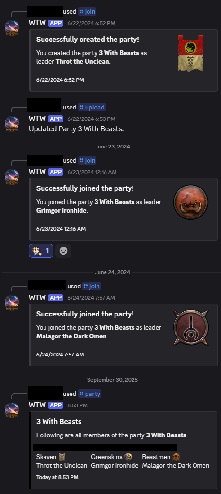

# Warhammer Total War 3 Bot
Discord Bot for managing multiplayer games of Total War Warhammer 3.
A "party" is basically the savegame you have with multiple players, you can name it what you like, who joined as what faction and leader choice will be saved.



## Requirements
You will need a web server and mysql database running.
node.js, tested with node 24.9.0.

## Setup
After checking out this repository to your public directory, perform the following steps in /wtwbot.

### Before launching

```npm install```
Downloads node modules and updates if neccecary.

Please create a configuration file in **/wtwbot/json-storage/config.json** with the following contents, filling out the empty spaces (you may rename the example file):
```
{
	"token": "<security token of the app/bot>",
	"clientId": "<ID of the bot>",
	"guildId": "<ID of the discord server>", 
	"dbhostname": "<SQL database IP/Domain>",
	"dbusername": "<SQL database username>",
	"dbpassword": "<SQL database password>",
	"dbdatabase": "<SQL database name>"
}
```
Register your bot as app and generate an security token:
https://discord.com/developers/applications

How to find your IDs: https://support-dev.discord.com/hc/en-us/articles/360028717192-Where-can-I-find-my-Application-Team-Server-ID

### To start
```node index.js```
Starts the app.

## List of supported commands:
*/join [faction] [leader] [partytag]*
- Join an existing party, or creates a new one if the partytag is new. 
- Faction is parent to leader, choose one before tabbing to the leader choice.

*/leave [partytag]*
- Leave an existing party.
s
*/parties*
- List all known parties.

*/party [partytag]*
- Show details of one party, with players, factions, leader choices, image and more.

*/profile*
- Show list of parties you have joined.

*/remove-party [partytag]*
- Removes a party form the database, for clean-up, use with caution.

*/upload [partytag] [file]*
- Add an image, screenshot of the map e.g. to the party details.

## Additional Info
Faction and leader data is up to date in **/wtwbot/json-storage/factions.json**, it is overwritten on update. *(better not modify this list)*

Want autostart or multiple instances, try PM2: https://www.slingacademy.com/article/pm2-how-to-auto-restart-nodejs-app-on-server-reboot/